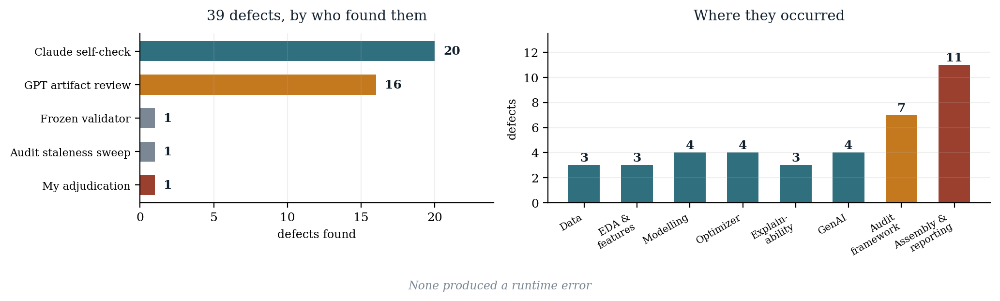

## 1. My role and project-control philosophy

This logbook records the prompts, directives and decisions through which I developed *Beyond the Price Tag*, and the verification process I established to control the AI systems used to build it.

The project was developed through iterative human-AI collaboration rather than a one-shot delegation of the work to an AI system. I directed the objectives and constraints, evaluated competing recommendations, froze methodological decisions, and required outputs produced by one AI system to be challenged and verified through a second AI system.

### 1.1 The control principles I established

These governed the project from the point at which each was set, and are the standards against which every artifact in the submission was checked.

1. **A hypothesis is tested, not assumed.** The central claim was made falsifiable and the testing procedure fixed in writing before any outcome was examined.
2. **Thresholds are pre-registered.** Any cutoff was chosen on validation data and applied once to the held-out season.
3. **Every number is traced to the artifact that produced it**, never copied from an intermediate description.
4. **A result reported by a generator is not evidence** until an independent, frozen check has evaluated the delivered artifact.
5. **Time discipline applies to the whole workflow**, not merely the train/test split.
6. **Claims are bounded by evidence level:** validated, supported association, illustrative or interpretive, and never stated more strongly.
7. **No new scope after finalisation begins.**

### 1.2 Convention

Text in quotation marks is verbatim from the working record. Text without quotation marks is a reconstructed summary. Where exact historical wording was unavailable, the interaction is summarised rather than presented as verbatim dialogue.

## 2. The adversarial AI workflow I established

I concluded early that a single AI system reviewing its own output was not an adequate control, because it shares its own blind spots. I therefore established a three-party process in which I was the only party with decision authority, and made it the governing control process for the project.

| Party | Function | Authority |
|---|---|---|
| **Myself** | Direct the research, adjudicate disputes, accept or reject every proposal | Sole decision authority |
| **Claude** | Build: write and run code, produce analysis, draft prose, assemble artifacts | Proposes only |
| **GPT** | Adversarially audit the delivered artifacts | Proposes only |

The cycle I ran for every phase:

```
I prompt Claude         ->  Claude builds and reports
I upload the ARTIFACTS  ->  GPT audits files, not summaries
I relay the critique    ->  Claude verifies, fixes or rebuts
I decide                ->  phase frozen
```

The critical design choice was mine: **GPT received the artifact files, never Claude's description of them.** Several defects were invisible in the description and visible only in the file. A recommended portfolio was reported as EUR 48M while the delivered file contained EUR 41M; only artifact-level review could have found that.

## 3. Prompt-by-prompt development record

Major decision points are recorded in the structure **my prompt, the AI action it produced, the resulting artifact, my adjudication, and the outcome.**

### 3.1 Project selection

**My prompt.**
> "I want you to act as an MBA Sports Analytics professor, an AI research supervisor, a sports business consultant, and a project mentor who will guide me from project selection until final submission. This is not just about finding an interesting AI model. The project should demonstrate that AI is being used to solve a managerial decision-making problem in sports."

I required 16 to 20 scored candidates, a top five, and then instructed the model to attack its own recommendation: *"Challenge your own recommendations. Pretend you are a faculty member trying to reject the proposal."*

**AI action.** 16 projects scored across nine criteria; an IPL auction system ranked first, football valuation second.

**My prompt, which overrode that ranking.**
> "I might not be able to rectify any errors in data joining or data cleaning as I am an MBA student, not a CSE undergraduate."

**My adjudication.** I rejected the top-ranked recommendation. The IPL option required fuzzy name-matching across independent sources; the football dataset joins entirely on integer identifiers. I judged data-integrity risk to outweigh the scoring difference.

**Outcome.** Football selected. **My stated working constraint, not the analytical scoring, determined the domain.** No entity-resolution defect occurred at any point in the project.

**My follow-up prompt.** I supplied two classmates' submitted titles and identified that one, *"Moneyball in the Top Flight"*, was near-identical to my working abstract. I directed that the project be differentiated rather than proceed into overlap.

**Outcome.** The four differentiators that structure the entire project, explainability, constrained optimisation, generated briefs and a back-test, follow from that instruction.

### 3.2 Scope and data

**My prompt, before committing to the dataset.**
> "The davidcariboo dataset is 230 MB. Can you process such a large file?"

**My adjudication.** I fixed the analytical scope in a single directive: five leagues, seasons 2015/16 through 2024/25, a 900-minute floor, a 26 August 2026 information cutoff, market value as the cost proxy, transfer fee as a robustness check only, strictly time-based validation.

I also corrected the notation:
> "I am deliberately expressing the seasons as 2015/16 to 2024/25, rather than '2015 to 2025', because that removes an ambiguity we do not want appearing anywhere in the report."

**Resulting artifact.** `player_season.csv` (15,925 player-seasons, 4,961 players), `data_quality_log.csv`.

**My rejection of two datasets.** I directed that a pre-joined enrichment dataset be excluded because its only join key was player name, and that the exclusion be reported as a methodological strength rather than omitted.

### 3.3 Feature engineering

**My adjudication on feature selection.** I identified that club variables were being chosen by correlating them against a residual computed from the target across the full sample:
> "We should not use the full sample's target-derived residual to decide which predictors belong in the model. It is a subtle form of target-informed feature selection."

I required pre-specification on managerial grounds instead, with any diagnostic confined to the training period.

**My decision on trajectory.** I ruled that career trajectory be defined through **performance history rather than valuation history**, so the model would explain value from football rather than reproduce the market's own persistence.

**Resulting artifact.** `feature_dictionary.csv`, classifying all 48 features by leakage status.

### 3.4 Modelling

**My prompt.** I directed the comparison be formalised as three nested specifications rather than a two-way contest: context only, fundamentals, fundamentals plus prior market value.

**My adjudication.** I required the market-informed model be retained as a benchmark rather than adopted:
> "Model 2's expected improvement is actually an interesting result rather than something we should be embarrassed about."

**My evaluation requirement.** *"Every model must be evaluated on exactly the same time-based test observations."*

**My extension of the leakage principle.**
> "Anything used to make a model-selection decision must be based only on information available in the training period. That applies to feature selection, hyperparameter tuning, model selection, threshold selection and mispricing cutoff selection, not just the train/test split."

**Resulting artifact.** `model_results.csv`. Model 1 R-squared 0.678 on the held-out season against 0.383 for the context benchmark; Model 2 reaching 0.884.

### 3.5 The hypothesis test, and the project's central decision

**My prompt, given before any result existed.**
> "Before we choose an 'undervalued' threshold such as the bottom 20% of residuals, we need to define it using validation data only. Then: validation, choose threshold. 2024/25 test, apply threshold once. No looking at test outcomes to decide what counts as undervalued."

I also fixed in advance what would count as evidence, requiring a position by league peer benchmark, position-appropriate performance measures, and full accounting for every flagged candidate.

**AI action.** The selection criterion was written into the script before any computation. Two pre-specified signals were tested.

**Resulting artifact.** `v2_signal_comparison.csv`, `v2_backtest_outcome.csv`. Neither signal produced an appreciation advantage: p = 0.094 and p = 0.307.

**My prompt, and the most consequential judgement in the project.**
> "Run a third undervaluation signal search: absolutely not."

**My adjudication.** Continuing was available and would have been easy. Iterating specifications until one reached significance would have converted a hypothesis test into a search and invalidated the entire procedure. I accepted the negative result.

**Outcome.** The founding hypothesis is reported as rejected. I then directed that the exit-risk relationship found in the diagnostic become the system's foundation, and specified the resulting narrative hierarchy myself: fundamentals explain valuation; prior market beliefs explain more; the residual does not identify exploitable mispricing; the residual does identify exit risk; therefore the system becomes risk-aware decision support.

### 3.6 Exit risk and the optimizer

**My prompt.**
> "We should not simply enter '30.1% exit risk' into the optimizer. That figure is a back-test outcome, not a probability model."

**My adjudication.** I refused to allow a back-test statistic to be used as a model input and required a separately validated component.

**Resulting artifact.** `exit_risk_performance.csv`. Held-out AUC 0.732, calibrated from 7.3% actual exit in the lowest decile to 69.5% in the highest.

**My rejection of the optimizer's objective.** I identified that maximising model-implied value minus cost would maximise **model error**, since the residual correlates with how cheap a player already is, and required the objective be withdrawn and replaced with a risk-adjusted formulation under explicit constraints.

**My governance requirement.** Weights declared in writing before execution, naive baselines reported alongside, sensitivity analysis mandatory.

**Resulting artifact.** `optimizer_specification.md`, `recommended_portfolio.csv`, `optimizer_sensitivity.csv`.

**My limit on what the portfolio may claim.**
> "The exit-risk model is validated at the population level; the portfolio is an illustrative application of the validated model, not an out-of-sample validation sample for the optimizer."

I required that caveat travel with every mention of the portfolio, including spoken delivery in the recorded demonstration.

### 3.7 Explainability

**My terminology ruling.** I required the residual audit be called *systematic residual heterogeneity* rather than *fairness bias*, since no formal fairness criterion was defined and the groups examined are competitive rather than protected characteristics.

**My prompt.** I asked for a replication check of the age gradient across the validation seasons, pre-specified so it could not be tuned.

**Resulting artifact.** `robustness_age_gradient.csv`. The gradient replicated in all three seasons.

**My adjudication on the permitted claim.**
> "The direction of the age-related residual gradient replicated across all three examined seasons, although its magnitude varied materially over time. Do not say the exact effect is a stable population parameter."

**My separation of explanation types.** I required the system distinguish *why the model produced this valuation* from *why the optimizer selected this player*, on the reasoning that a persuasive valuation explanation must not substitute for a selection rationale.

### 3.8 Generative AI and cross-model validation

**My decision not to use an API.** I declined to expose an API credential and directed that evaluation proceed through conversational invocation, with the execution route stated plainly in the report rather than implying a scripted API call.

**My experimental design.** A three-arm evaluation: a deterministic control, one conversational arm from each model family, all passed through a single frozen validator.

**My adjudication on independence.**
> "We should not describe Arm C as 'independent' simply because GPT is a different model family. It is less dependent on the validator's authoring model, not fully independent."

**My prompt requiring measurable evidence.**
> "We shouldn't just demonstrate three nice-looking AI-generated paragraphs. Create a fidelity check: numerical fidelity, no unsupported attributes, decision consistency, uncertainty disclosure."

I also required the checker be tested against deliberately planted violations, on the reasoning that a checker which passes everything proves nothing.

**My prohibition on speculation.**
> "The LLM should be prohibited from inferring those things even probabilistically. It shouldn't write 'his low minutes may indicate injury concerns' unless injury information was actually supplied."

**AI action, and the result I consider most instructive.** Claude generated three briefs. Its own frozen validator **rejected one**, catching three fabricated figures in an otherwise fluent, structurally complete document that passed the other five checks.

**My rejection of an unverified result.** GPT then reported a passing score without supplying the files it had scored. I refused to record it and required the artifacts. GPT withdrew the claim:
> "I took a shortcut precisely where this project was designed not to take shortcuts. The previous GPT 3/3 claim is withdrawn. It has no status in the project."

**Outcome.** The supplied payload was verified byte-identical to canonical and the validator checksum unchanged before Claude's frozen validator was run against GPT's files. **That sequence, one model's validator evaluating another model's artifacts under my adjudication, is the methodological contribution I consider most distinctive in this project.**

**Resulting artifact.** `genai_arm_history.csv`, `genai_armC_results.csv`, `genai_controls.csv`.

**My ruling on how the result is reported.**
> "I would not call the Claude rerun 'the result'. The intellectually important result is the transition: generation, detection, correction, controlled rerun."

And, prohibited in advance:
> "Don't let the final report say 'The GenAI system achieved 100% factual accuracy.' It didn't."

### 3.9 Verification and control

**My foundational rule**, established after several transcription errors.
> "Every number in the report must be pulled from the final artifact that generated it, not copied from conversational prose."

I required this be formalised as a written control document rather than left as a habit.

**My claim-class control.**
> "The project has become sophisticated enough that claim drift is now a bigger risk than arithmetic drift."

I specified the permitted evidence level for each class of claim and required the audit enforce them mechanically.

**My completeness requirement.** A report containing an unfilled personal-details field should never be able to reach a passing audit.

**My hardcoding rule**, after finding the audit's own canonical table contained a hardcoded empirical value.
> "No hardcoded canonical numerical values anywhere in the audit except values that are explicitly constants by definition."

**My detection of a corrupted statistic.** During finalisation I found that an assembly bug had temporarily corrupted two figures in the report: the odds ratio from its correct value of 4.82 to 7.82 in two places, and the distribution skew from 3.90 to 6.90. Investigation traced both to a regex in the assembly script that matched any decimal number rather than only section references. Nothing else had detected the skew corruption. **Both were corrected at source and the corrupted values appear nowhere in the submitted work**; the correct figures are 4.82 and 3.90 throughout.

**Outcome.** I required a superseded-value scan so no known-incorrect figure could appear in any artifact.

**Resulting artifact.** `final_audit.py`, `canonical_figures.csv` (33 figures, each typed source-direct, derived or display-defined), `PROJECT_CONTROL_RULES.md`.

**My finalisation discipline.**
> "No new analytical ideas. No new signals. No new models. No new scope. Only completion, integration, formatting and verification."

### 3.10 Reporting and academic integrity

**My structural correction.** I required the report be renumbered so Dataset Description became a top-level section matching the institute template, and that the numbering be contiguous rather than leaving a gap where a section had been promoted.

**My title decision.** I retained the registered title despite the empirical conclusion being more nuanced, on the ground that the title describes the decision problem the system addresses rather than a guaranteed finding.

**My abstract decision.** I ruled the report abstract must state the outcome of the test rather than reuse the proposal abstract, which described the back-test without reporting its result.

**My correction to the AI-use declaration.** A draft stated that AI had played no role in research design. I rejected it as inaccurate:
> "AI did materially participate in the research-design process. That doesn't diminish your authorship. It means the honest formulation is: AI was used to support and challenge research-design decisions; the final methodological choices, interpretations, conclusions and acceptance or rejection of proposed approaches were made by the author."

I required the declaration record AI's role accurately rather than understate it, on the ground that understating AI's contribution in a document signed under an academic-honesty clause would be the more serious failure.

## 4. Major decisions I personally adjudicated

| Decision point | AI recommendation | My decision | Rationale | Artifact |
|---|---|---|---|---|
| Domain selection | IPL auction ranked first | **Football** | Data-integrity risk under my stated constraint; class differentiation | `player_season.csv` |
| Career trajectory | Could include prior market value | **Performance history only** | Prevents the model reproducing market persistence | `feature_dictionary.csv` |
| Club variables | Selected via full-sample residual | **Pre-specified on managerial grounds** | Target-informed selection is not admissible | `feature_engineering.py` |
| Model comparison | Two-way linear vs boosted | **Three nested specifications** | Separates explaining value from predicting the market | `model_results.csv` |
| Mispricing threshold | Several candidates available | **Pre-registered on validation, applied once** | Prevents test-set leakage | `v2_threshold_selection.csv` |
| Third signal search | Available and easy to run | **Stopped after two nulls** | Preserves falsifiability | `v2_signal_comparison.csv` |
| Optimizer objective | Maximise valuation residual | **Withdrawn and replaced** | Maximising the residual maximises model error | `optimizer_specification.md` |
| Exit risk input | Could hardcode the 30.1% rate | **Build a validated model first** | A back-test outcome is not a probability model | `exit_risk_performance.csv` |
| Portfolio claim | Could present as validation | **Illustrative only, n = 3** | Three players cannot establish effectiveness | `recommended_portfolio.csv` |
| Arm C independence | Described as independent | **Partial independence only** | Generator had visibility of the check design | `genai_arm_history.csv` |
| Arm C result | GPT self-reported 3/3 | **Not accepted without artifacts** | A result reported by a generator is not evidence | `genai_armC_results.csv` |
| Report abstract | Reuse the proposal abstract | **Result-bearing rewrite** | An abstract must state the outcome of its own test | Report front matter |
| AI-use declaration | AI played no role in design | **Rejected as inaccurate** | Understating AI's role is the more serious failure | Appendix F |

## 5. Errors caught, challenged and corrected

**39 defects and control failures were documented across development and finalisation.** None produced a runtime error. Every one surfaced through comparison against a file, a rendered page, a validation result, or the underlying data.

| Detected by | Count |
|---|---|
| Claude self-checking its own output against artifacts | 20 |
| GPT auditing delivered artifacts | 16 |
| The frozen fidelity validator | 1 |
| The audit's staleness sweep | 1 |
| My adjudication of an unverified claim | 1 |




Defects that would otherwise have reached submission include: a corrupted odds ratio and a corrupted distribution skew; a report silently missing 1,900 words after an assembly fault; a recommended portfolio whose reported value disagreed with its own source file; three fabricated statistics inside a fluent AI-generated recruitment brief; three separate forms of test-set leakage; a distinct target-informed feature-selection defect drawn from the full sample rather than the training period; a mis-stated estimator name; an odds ratio reported as a risk ratio across six artifacts; and a limitation asserting the opposite of the completed evidence.

Two defects were found inside the control system itself: the audit designed to eliminate hardcoded empirical values contained two of them, and a further instance had reappeared one layer down in its lookup keys.

## 6. Cross-model generative-AI evaluation

The evaluation I specified produced a result no single-model process could have generated.

| Arm | Generator | Independence from validator authorship | Result |
|---|---|---|---|
| A | Deterministic template | Full, no model involved | 3/3 |
| B | Claude, conversational | None, same family authored the validator | **1/3**, then 3/3 after correction |
| C | GPT, conversational | Partial, different family with visibility of the design | 3/3 |

The finding is Arm B's initial failure, not the passing scores. A fluent, structurally complete recruitment brief contained three invented statistics. It failed the numerical-fidelity check while passing the other five automated checks, which is why the failure was hard to notice by reading: nothing in the prose signalled it. Only comparison against the source payload exposed it.

Two controls establish that the cross-model pass is substantive: the GPT briefs carried 74.3 numeric claims per 1,000 words, so they did not pass by avoiding numbers; and six violations planted into GPT's own text were all detected, so the validator was actively evaluating rather than waving text through.

## 7. Division of responsibility

**AI was used to generate and assist with** the code, figures, workbook, dashboard and drafted report content, and to make substantive methodological proposals including the domain shortlist, the time-consistency architecture, the exit-risk component and the explainability design.

**I directed and retained authority over** the research question and constraints; the decision to treat the central claim as falsifiable; the pre-registration discipline; the refusal to continue searching after two null results; the reframing around exit risk; the terminology governing statistical claims; the artifact-traceability rule; the claim-class control; the adversarial verification workflow; and the adjudication of every disagreement between the two systems.

I also **rejected AI proposals**, including a relabelling that would have introduced an error, an unverified experimental result, and a declaration that understated AI's own contribution.

## 8. Reflection

The most useful thing this process produced was not speed. It was the repeated discovery that **an artifact can be fluent, complete, internally consistent and wrong**.

A recruitment brief containing three invented statistics was detected by the validator while the other five dimensions passed. A report that had lost 1,900 words assembled without error. An audit built specifically to eliminate hardcoded values contained two of them. A section confidently stated a limitation that had ceased to be true.

None of these were reliably detectable by reading. All were found by comparison against the thing that produced them.

That is the same conclusion this project reaches about football valuation: a model's confident output is a question to investigate, not an answer to act on. Designing the verification process taught me the finding before the analysis proved it.
